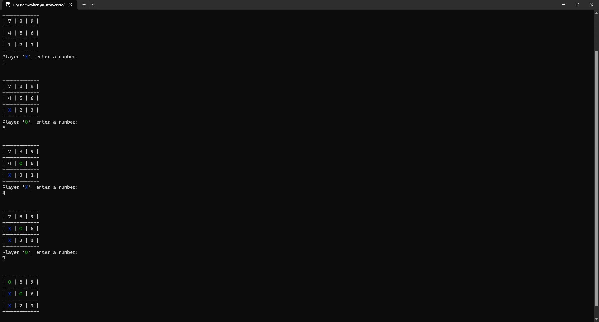

---

# 🕹️ **Rust Tic-Tac-Toe Game**



Welcome to the **Rust Tic-Tac-Toe Game**! 🎮 This is my **first Rust project**, created to practice and learn the fundamentals of the Rust programming language. It's a simple, console-based game of Tic-Tac-Toe where you can play against another player in your terminal. 😄

### 🚨 **Disclaimer**
This is my first attempt at Rust, so the code might not be the most efficient or idiomatic just yet. Please don't hesitate to open issues or make suggestions to improve the project. This code is a work-in-progress, and I hope to refine it as I continue learning Rust! 🚀

---

### 📥 **Installation**

To quickly get started with the game, follow these steps:

1. **Download the latest release**:  
   Go to the [latest release page](https://github.com/chrohangurjar/Rust-Tic-Tac-Toe-Game/releases) on GitHub and download the binary for your operating system (Windows, macOS, or Linux).

   > **Note for Windows/macOS users**: You may see a security warning because the binaries are not signed. You can safely **ignore these warnings**.

2. **Run the game**:  
   After downloading, execute the binary to start playing the game. 🎮

---

### 🛠️ **Build From Source**

If you want to build the game yourself or customize it, follow these steps:

1. **Clone the repository**:
   You can either [download the `.zip` file](https://github.com/chrohangurjar/Rust-Tic-Tac-Toe-Game/archive/master.zip) or clone the repository using Git:
   ```bash
   git clone https://github.com/chrohangurjar/Rust-Tic-Tac-Toe-Game.git
   ```

2. **Install Rust**:
   If you don’t have Rust installed, follow the official guide here: [Install Rust](https://www.rust-lang.org/en-US/install.html).

3. **Build and run the project**:
   Navigate to the project directory:
   ```bash
   cd Rust-Tic-Tac-Toe-Game
   ```

   Then, run this command to build and run the game:
   ```bash
   cargo run --release
   ```

4. **Enjoy the game**: 🎮  
   Follow the on-screen prompts to start playing Tic-Tac-Toe!

---

### 🚀 **How to Play**

- The game is played in your terminal with players taking turns to place their marks (X or O).
- Player **X** goes first, followed by player **O**.
- The game board is represented like this:

```
1 | 2 | 3
---------
4 | 5 | 6
---------
7 | 8 | 9
```

You simply enter the number (1-9) where you want to place your mark, and the game will update the board accordingly. ✨

**Objective**: The goal is to get three of your marks in a row—either horizontally, vertically, or diagonally.

---

### ✨ **Future Improvements**

Here are some ideas to enhance the game in future versions:

- **AI Opponent**: Implement an AI that can play against the user (perhaps using the minimax algorithm).
- **Graphical User Interface (GUI)**: Use a Rust GUI library like `druid` or `gtk-rs` to create a more interactive visual experience.
- **Multiplayer Online**: Add functionality to play against friends over the internet.

Feel free to contribute to these improvements or suggest new ones! 💡

---

### 👥 **Contributing**

If you’d like to contribute to this project:

1. Fork the repository.
2. Make your changes or improvements.
3. Open a **Pull Request** with your changes.

You can also report bugs or suggest features by opening an [issue](https://github.com/chrohangurjar/Rust-Tic-Tac-Toe-Game/issues).

---

### ⭐ **Star the Project**

If you found this project useful or fun to play, please give it a ⭐ on GitHub! It means a lot and encourages me to keep learning and improving. 😄

---

### 🙏 **Thanks for checking out my project!**

I hope you enjoy playing **Rust Tic-Tac-Toe**. If you have any questions or feedback, feel free to reach out. Happy coding, and may the best player win! 🏆

---
